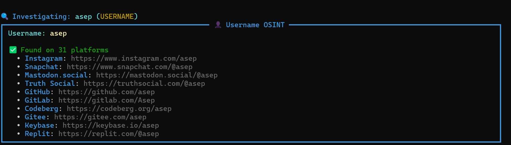
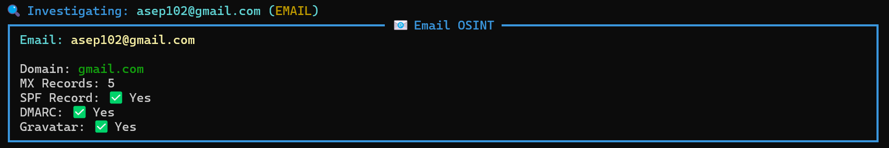
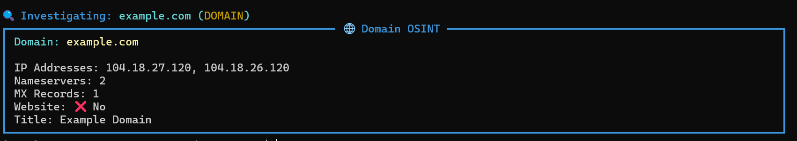
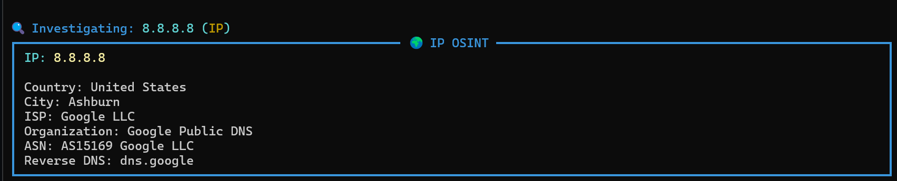

<!-- GhostIntel v2.0 - OSINT Framework Python Indonesia - digital investigation tools username email domain IP phone number lookup reconnaissance cybersecurity ethical hacking open source intelligence osint-indonesia osint-tool osint-framework python-osint phone-number-lookup username-search kali-linux-tools bug-bounty-recon information-gathering no-api-key async-python -->

# 👻 GhostIntel v2.0

*GhostIntel is a Python-based OSINT framework for digital investigation using public data such as username, email, domain, IP address, and phone number.*

**OSINT Framework Indonesia • Digital Investigation Tools • Public Data**

<div align="center">

[](https://python.org)
[](LICENSE)
[]()
[](https://github.com/ruyynn/GhostIntel/stargazers)
[]()
[](CONTRIBUTING.md)
[](https://github.com/ruyynn/GhostIntel/network)
[](https://github.com/ruyynn/GhostIntel/issues)
[](https://github.com/ruyynn/GhostIntel)

</div>

---

## 📌 About GhostIntel

*GhostIntel is a Python-based OSINT framework designed to assist digital investigation using publicly available data. This tool combines various reconnaissance techniques such as username analysis, email investigation, domain scanning, IP address lookup, and phone number intelligence into one lightweight and easy-to-use system.*

*GhostIntel focuses on **collecting intelligence from open sources (Open Source Intelligence)** without performing any illegal access to target systems. Developed by **Ruyynn**, this project aims to provide an OSINT toolset that is **fast, modular, and easy to use** for security researchers, developers, and cybersecurity learners.*

*With a modular approach, GhostIntel allows easy addition of new modules so it can continuously evolve alongside modern digital investigation needs.*

---

## 🚀 Why GhostIntel?

```
✅ Zero API Keys      — Use immediately, no registration or payment required
✅ Async & Fast       — Parallel investigation, far faster than similar tools
✅ Auto Entity Detect — Input anything, GhostIntel detects the type automatically
✅ Multi-Country      — Phone OSINT for 5 countries at once
✅ 100+ Platforms     — Username checked across 100+ sites simultaneously
✅ Data Correlation   — All findings from different modules linked automatically
✅ Export Reports     — Save results to JSON, HTML, or TXT
✅ Made in Indonesia  — Optimized for local investigation needs
```

### 🎯 Use Cases

| Scenario | Description |
|----------|-------------|
| 🔍 **Digital Investigation** | Collect information from various public sources |
| 🛡️ **Security Reconnaissance** | Initial footprinting before security testing |
| 🧠 **OSINT Learning** | Practical learning tool for cybersecurity beginners |
| 🐞 **Bug Bounty Recon** | Identify initial target information before testing |
| 📊 **Research & Analysis** | Collect open data for security analysis and research |

---

## ✨ Key Features

### 🔮 Auto Entity Detection

No need to specify the target type. GhostIntel detects it automatically!

```bash
┌──(ghostintel㉿localhost)-[~]
└─$ ghostintel investigate ruyynn
[+] Detected: USERNAME

┌──(ghostintel㉿localhost)-[~]
└─$ ghostintel investigate mail@test.com
[+] Detected: EMAIL

┌──(ghostintel㉿localhost)-[~]
└─$ ghostintel investigate 08123456789
[+] Detected: PHONE (Indonesia)

┌──(ghostintel㉿localhost)-[~]
└─$ ghostintel investigate example.com
[+] Detected: DOMAIN

┌──(ghostintel㉿localhost)-[~]
└─$ ghostintel investigate 8.8.8.8
[+] Detected: IP ADDRESS
```

---

## 📱 Phone OSINT — 5 Countries

> The only Indonesian OSINT tool with **multi-country phone lookup** support!

<details>
<summary><b>🇮🇩 Indonesia (+62)</b></summary>
<br>

```bash
ghostintel -p 08123456789
```

| Info | Result |
|------|--------|
| Provider | Telkomsel / Indosat / XL / Three / Smartfren |
| Type | Mobile / Fixed Line |
| Valid | ✅ Yes |
| Format | +62 812-3456-789 |
| Location | Jakarta / West Java / etc |

**Detected Providers:**

| Prefix | Provider |
|--------|----------|
| 0811, 0812, 0813, 0821, 0822, 0823, 0851, 0852, 0853 | 📱 Telkomsel |
| 0814, 0815, 0816, 0855, 0856, 0857, 0858 | 📱 Indosat |
| 0817, 0818, 0819, 0877, 0878, 0879 | 📱 XL |
| 0895, 0896, 0897, 0898, 0899 | 📱 Three |
| 0881, 0882, 0883, 0884, 0885, 0886, 0887, 0888, 0889 | 📱 Smartfren |

</details>

<details>
<summary><b>🇺🇸 USA (+1)</b></summary>
<br>

```bash
ghostintel -p +12125551234
```

| Info | Result |
|------|--------|
| Provider | AT&T / Verizon / T-Mobile |
| Area Code | 212 (New York) |
| Type | Mobile |
| Valid | ✅ Yes |

**Area Codes:**

| Code | City | Provider |
|------|------|----------|
| 212, 646 | New York | AT&T / Verizon |
| 310, 818 | Los Angeles | T-Mobile / AT&T |
| 415, 510 | San Francisco | AT&T |
| 617 | Boston | Verizon |
| 702 | Las Vegas | T-Mobile |
| 832 | Houston | T-Mobile |

</details>

<details>
<summary><b>🇬🇧 UK (+44)</b></summary>
<br>

```bash
ghostintel -p +447700123456
```

| Info | Result |
|------|--------|
| Provider | EE / O2 / Vodafone / Three |
| Type | Mobile |
| Valid | ✅ Yes |

**Mobile Prefixes:**

| Prefix | Provider |
|--------|----------|
| 7700–7709, 7750–7752 | EE |
| 7710–7719, 7740–7742 | O2 |
| 7720–7725 | Vodafone |
| 7730–7735 | Three |

</details>

<details>
<summary><b>🇲🇾 Malaysia (+60)</b></summary>
<br>

```bash
ghostintel -p +60123456789
```

| Info | Result |
|------|--------|
| Provider | Maxis / Celcom / DiGi / U Mobile |
| Type | Mobile |
| Valid | ✅ Yes |

**Mobile Prefixes:**

| Prefix | Provider |
|--------|----------|
| 012, 017 | Maxis |
| 013, 019 | Celcom |
| 010, 016 | DiGi |
| 011, 018 | U Mobile |
| 014, 015 | Maxis/Celcom / Tune Talk |

</details>

<details>
<summary><b>🇮🇳 India (+91)</b></summary>
<br>

```bash
ghostintel -p +919876543210
```

| Info | Result |
|------|--------|
| Provider | Airtel / Vodafone / Jio / BSNL |
| Type | Mobile |
| Valid | ✅ Yes |

**Mobile Prefixes:**

| Prefix | Provider |
|--------|----------|
| 9810–9819 | Airtel |
| 9820–9825 | Vodafone |
| 9870–9874 | Jio |
| 8888–8890 | BSNL |
| 9830–9834 | Idea |

</details>

---

## 👤 Username OSINT

Check usernames in parallel across **100+ platforms** in one run — Facebook, Instagram, Twitter, GitHub, TikTok, Steam, Kaskus, and many more.

<p align="center">
  
</p>

---

## 📧 Email OSINT

Email investigation: MX records, SPF, DMARC, Gravatar, disposable & free provider detection.

<p align="center">
  
</p>

---

## 🌐 Domain OSINT

Full DNS records: A, AAAA, NS, MX, TXT, SOA, CNAME + HTTP/HTTPS status + website title.

<p align="center">
  
</p>

---

## 🌍 IP OSINT

Geolocation, Reverse DNS, RDAP to 5 global RIRs (ARIN, RIPE, APNIC, LACNIC, AFRINIC), proxy & hosting detection.

<p align="center">
  
</p>

---

## 📊 Report Generator

Generate professional reports in 3 formats!

```bash
# HTML Report — visual & interactive
ghostintel investigate target --format html -o report.html

# JSON Report — for parsing & further integration
ghostintel investigate target --format json -o data.json

# TXT Report — simple & lightweight
ghostintel investigate target --format txt -o output.txt
```

---

## 🔧 Installation

**Method 1 — Direct Clone**

```bash
git clone https://github.com/ruyynn/GhostIntel.git
cd GhostIntel
pip install -r requirements.txt
python ghostintel.py -h
```

**Method 2 — Virtual Environment (Recommended)**

```bash
git clone https://github.com/ruyynn/GhostIntel.git
cd GhostIntel

python -m venv venv
source venv/bin/activate        # Linux / macOS
# venv\Scripts\activate         # Windows

pip install -r requirements.txt
python ghostintel.py -h
```

---

## 📖 Usage Guide

**Basic Commands**

```bash
python ghostintel.py -h                          # Help
python ghostintel.py -v                          # Version
python ghostintel.py investigate TARGET          # Auto-detect

python ghostintel.py -u username                 # Username
python ghostintel.py -e email@example.com        # Email
python ghostintel.py -p 08123456789              # Phone Indonesia
python ghostintel.py -p +12125551234             # Phone USA
python ghostintel.py -p +447700123456            # Phone UK
python ghostintel.py -p +60123456789             # Phone Malaysia
python ghostintel.py -p +919876543210            # Phone India
python ghostintel.py -d example.com              # Domain
python ghostintel.py -i 8.8.8.8                 # IP Address
```

**Report & Output**

```bash
python ghostintel.py -u username --report
python ghostintel.py -d example.com --format html -o example.html
python ghostintel.py -e email@example.com --format json -o email.json
python ghostintel.py -p 08123456789 --format txt -o phone.txt
```

**Advanced Options**

```bash
python ghostintel.py -d example.com --timeout 30     # Custom timeout
python ghostintel.py -u username --threads 50         # More threads
python ghostintel.py -u username --no-color           # Disable colors
```

---

## 📋 Requirements

```
Python         3.8+
aiohttp        3.9.0+
beautifulsoup4 4.12.0+
dnspython      2.6.0+
phonenumbers   8.13.0+
rich           13.7.0+
tldextract     5.1.0+
jinja2         3.1.0+
aiofiles       23.2.0+
colorama       0.4.6+
```

---

## 🏗️ Project Structure

```
📁 GhostIntel/
├── 📄 ghostintel.py           ← Entry point & CLI parser
├── 📄 requirements.txt
├── 📄 README.md
├── 📄 CONTRIBUTING.md
├── 📄 LICENSE
│
├── 📁 core/
│   ├── engine.py              ← Main orchestrator
│   ├── detector.py            ← Auto entity detection
│   ├── banner.py              ← Rich terminal UI
│   ├── utils.py               ← Utilities & help menu
│   └── correlation.py         ← Intelligence correlator
│
├── 📁 modules/
│   ├── base.py                ← Base class for all modules
│   ├── username.py            ← Username checker (100+ platforms)
│   ├── email.py               ← Email investigator
│   ├── phone.py               ← Phone OSINT (5 countries)
│   ├── domain.py              ← Domain + DNS scanner
│   └── ip.py                  ← IP + RDAP + geolocation
│
├── 📁 sources/
│   ├── social_media.py        ← 100+ platform URL database
│   ├── phone_db.py            ← Provider prefix database
│   └── breach_db.py           ← Public breach database
│
├── 📁 reports/
│   ├── generator.py           ← Report engine (JSON/HTML/TXT)
│   ├── html_template.py       ← Jinja2 HTML template
│   └── json_formatter.py      ← JSON serializer
│
└── 📁 output/                 ← Auto-generated reports
```

---

## ⚠️ Legal Disclaimer

**Purpose** — GhostIntel is built only for:
- Education and cybersecurity learning
- Legitimate security research
- Testing on systems you own or have explicit permission to test
- Developing OSINT and reconnaissance skills professionally

**Data Sources** — GhostIntel only uses public sources:
- Public DNS lookup, RDAP / WHOIS records
- Information from public websites & legal APIs
- Data that is already openly available

**Prohibited Use** — Strictly forbidden:
- Doxing or exposing personal data without consent
- Stalking, harassment, or intimidation
- Illegal or criminal activities
- Accessing systems or data without authorization

> By using GhostIntel, you take full responsibility for how you use this tool. The author is not responsible for any misuse.

---

## 📝 License

MIT License — Feel free to use, modify, and distribute with credit to **Ruyynn**.

---

## 👨‍💻 Author

**Ruyynn** — Developer & Maintainer

| Platform | Link |
|----------|------|
| 🐙 GitHub | [](https://github.com/ruyynn) |
| 📘 Facebook | [](https://web.facebook.com/profile.php?id=61587795784907) |
| 📸 Instagram | [](https://www.instagram.com/ellreynn) |
| 📧 Email | [](mailto:ruyynn25@gmail.com) |

---

### 📌 Project Links

| Link | Purpose |
|------|---------|
| [](https://github.com/ruyynn/GhostIntel) | Main repository |
| [](https://github.com/ruyynn/GhostIntel/issues) | Report a bug |
| [](https://github.com/ruyynn/GhostIntel/discussions) | Discussions & suggestions |

---

## 🤝 Contributing

Contributions are very welcome!

1. 🍴 Fork this repository
2. 🌿 Create a new branch — `git checkout -b cool-feature`
3. 💻 Commit your changes — `git commit -m 'feat: add cool feature'`
4. 📤 Push to branch — `git push origin cool-feature`
5. 🔄 Open a Pull Request

Read the full guide → [CONTRIBUTING.md](CONTRIBUTING.md)

---

## ⭐ Support & Star

<div align="center">

> **If GhostIntel has been useful to you, a single ⭐ star goes a long way in keeping this project alive and growing!**

[](https://github.com/ruyynn/GhostIntel/stargazers)

</div>

| # | How to Support |
|---|----------------|
| 1 | ⭐ **Star** this repository |
| 2 | 📢 **Share** with friends, communities, or cybersecurity groups |
| 3 | 🐛 **Report** bugs you find |
| 4 | 💡 **Suggest** new features via Discussions |
| 5 | 🤝 **Contribute** code or documentation |

### 💖 Donate

| Platform | Link | For |
|----------|------|-----|
| 🇮🇩 **Saweria** | <a href="https://saweria.co/Ruyynn"></a> | Indonesian donors |
| 🌍 **Ko-fi** | <a href="https://ko-fi.com/H2H11W13IP"></a> | International donors |

> *Every donation and star means a lot for the continued development of GhostIntel! 💪*

---

## 📞 Contact

<div align="center">

[](https://github.com/ruyynn)
[](https://web.facebook.com/profile.php?id=61587795784907)
[](https://www.instagram.com/ellreynn)
[](mailto:ruyynn25@gmail.com)

</div>

### 💬 Get in Touch

- 🐛 **Report a bug** → [GitHub Issues](https://github.com/ruyynn/GhostIntel/issues)
- 💡 **Feature request** → [GitHub Discussions](https://github.com/ruyynn/GhostIntel/discussions)
- ❓ **Questions** → DM via social media above
- 🤝 **Collaboration** → [Contact Me](mailto:ruyynn25@gmail.com)

---

## 🙏 Thank You

<div align="center">

**Thank you to all contributors, users, and donors who have supported GhostIntel!**

This tool is built with ❤️ for the advancement of cybersecurity knowledge.

---


---

**GhostIntel v2.0**
*OSINT Framework Indonesia • 100% Public Data • For Cybersecurity Education*

© 2026 Ruyynn. All Rights Reserved.

</div>
