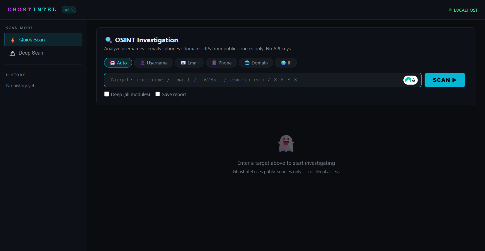
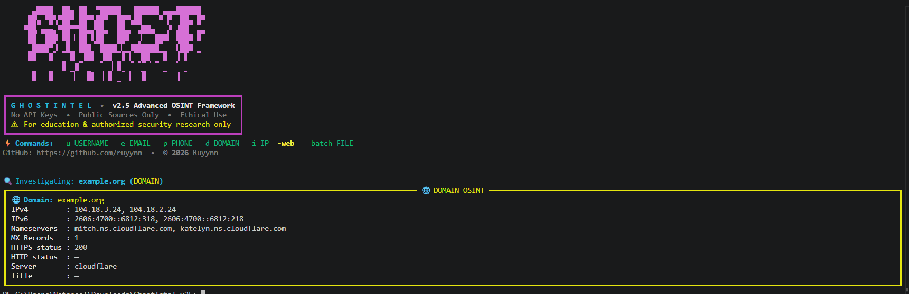
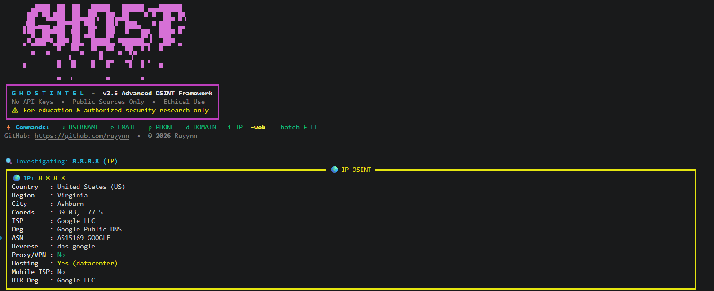
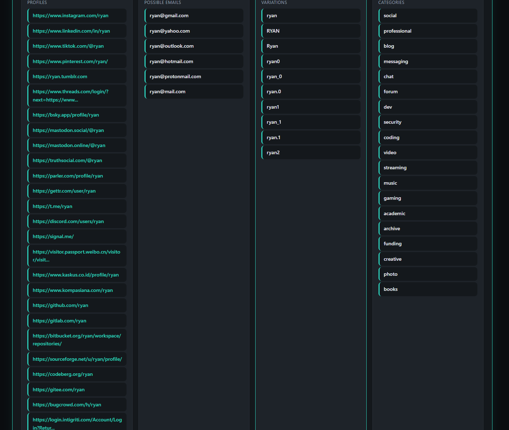

<!--------------------------------------------------------------
GhostIntel v2.5 - Advanced OSINT Framework
OSINT Framework Indonesia | No API Keys | 8 Countries | 129+ Platforms
Web UI | Batch Processing | Breach Detection | Risk Scoring
--------------------------------------------------------------->

<div align="center">


# 👻 GhostIntel v2.5

### *The Ultimate API-Free OSINT Framework*

**Zero API Keys • 100% Public Data • Made in Indonesia**

[](https://python.org)
[]()
[](https://github.com/ruyynn/GhostIntel/stargazers)
[](https://github.com/ruyynn/GhostIntel/releases)
[](LICENSE)
[]()

</div>

---

## 📑 **Table of Contents**

<details>
<summary><b>Click to expand 📖</b></summary>

| Section | Description |
|---------|-------------|
| [About GhostIntel](#-about-ghostintel) | What is this tool? |
| [Why v2.5?](#-why-ghostintel-v25) | Key advantages |
| [What's New](#-whats-new-in-v25) | v2.5 features |
| [Quick Start](#-quick-start) | Installation & first scan |
| [Web UI](#-web-ui--the-game-changer) | Localhost dashboard |
| [Phone OSINT](#-phone-osint--8-countries) | 8 countries supported |
| [Email Breach](#-email-breach-detection) | Leak alerts + risk score |
| [Username OSINT](#-username-osint--129-platforms) | 129+ platforms |
| [Domain OSINT](#-domain-osint--complete-recon) | DNS + HTTP + tech stack |
| [IP OSINT](#-ip-osint--geolocation--risk-scoring) | Location + threat score |
| [Reports](#-report-formats) | JSON, HTML, TXT, MD |
| [Batch Processing](#-batch-processing) | Multi-target scan |
| [Screenshots](#-screenshots) | See it in action |
| [Star History](#-star-history) | Project growth |
| [Disclaimer](#️-legal-disclaimer) | Read before using |

</details>

---

## 👻 **About GhostIntel**

**GhostIntel** is a **powerful, API-free OSINT framework** that helps you investigate publicly available data about usernames, emails, phone numbers, domains, and IP addresses.

> 💡 **How it works:** Just type a target — username, email, phone, domain, or IP — and GhostIntel scans **hundreds of public sources** to find everything connected to it.

### 🔥 **Core Features**

| # | Feature | What It Means |
|---|---------|---------------|
| 1 | 🔓 **Zero API Keys** | Use immediately — no signup, no payment, no hidden costs |
| 2 | ⚡ **Async & Fast** | Parallel scanning, 10x faster than similar tools |
| 3 | 🎯 **Auto Detect** | Paste anything, GhostIntel auto-detects the type |
| 4 | 🌐 **Web UI** | Beautiful localhost dashboard (BRAND NEW in v2.5!) |
| 5 | 📱 **8 Countries** | Phone OSINT: ID, US, GB, MY, IN, AU, SG, PH |
| 6 | 🔥 **129+ Platforms** | Username checking across 129+ sites simultaneously |
| 7 | 🔗 **Data Correlation** | Links findings across all modules automatically |
| 8 | 📊 **Breach Detection** | Email leak alerts + risk score (0-100) |
| 9 | 📦 **Batch Processing** | Scan multiple targets from a single file |
| 10 | 📄 **4 Report Formats** | JSON, HTML, TXT, Markdown |

> *Developed by **Ruyynn** — Made in Indonesia, for the global cybersecurity community.*

---

## 🚀 **Why GhostIntel v2.5?**

GhostIntel stands out because it's **built for real investigations** — not just another wrapper around paid APIs.

```
   ✓  ZERO API KEYS       →  No registration, no payments, just pure OSINT    
   ✓  ASYNC & FAST        →  10x faster than other free tools                 
   ✓  AUTO DETECT         →  Input anything, GhostIntel figures it out        
   ✓  WEB UI              →  Localhost dashboard with dark/light theme        
   ✓  8 COUNTRIES         →  Phone OSINT: ID/US/GB/MY/IN/AU/SG/PH             
   ✓  129+ PLATFORMS      →  Most comprehensive username checker              
   ✓  BREACH DETECTION    →  Email alerts with risk scoring                   
   ✓  BATCH PROCESSING    →  Scan hundreds of targets at once                 
   ✓  ROTATING USER-AGENT →  14+ UAs to avoid being blocked                                                                                               
```

---

## ✨ **What's New in v2.5?**

This is a **MAJOR upgrade** from v2.0. Here's what's new:

| Feature | v2.0 | v2.5 | Impact |
|---------|------|------|--------|
| 🌐 **Web UI** | ❌ | ✅ | **Game changer!** Full dashboard |
| 📱 **Phone Countries** | 5 | **8** | Added AU, SG, PH |
| 🔥 **Breach Detection** | ❌ | ✅ | Email leak alerts + risk score |
| 📦 **Batch Processing** | ❌ | ✅ | Multi-target scanning |
| 📄 **Markdown Reports** | ❌ | ✅ | New report format |
| 🗜️ **JSON Compression** | ❌ | ✅ | Gzip support |
| 🔄 **Rotating User-Agent** | ❌ | ✅ | 14+ UAs to avoid blocks |
| 🛡️ **SSL/TLS Info** | ❌ | ✅ | Certificate details |
| 📊 **Risk Scoring** | ❌ | ✅ | IP risk score (0-100) |
| 🎯 **Username Platforms** | 100+ | **129+** | +29 more platforms |

> **v2.5 is the most complete version yet — with Web UI, breach detection, and 8 countries for phone OSINT!**

---

## 🎬 **Quick Start**

### Installation

```bash
# Clone the repository
git clone https://github.com/ruyynn/GhostIntel.git
cd GhostIntel

# Install dependencies
pip install -r requirements.txt

# Verify installation
python ghostintel.py -h
```

### First Scan Examples

```bash
# 👤 Username investigation
python ghostintel.py -u ruyynn

# 📧 Email with breach detection
python ghostintel.py -e user@gmail.com --report

# 📱 Phone number (Indonesia)
python ghostintel.py -p 08123456789

# 🌐 Domain recon with tech detection
python ghostintel.py -d example.com --deep

# 🌍 IP geolocation + risk score
python ghostintel.py -i 8.8.8.8

# 🌐 Launch Web UI (NEW!)
python ghostintel.py -web
```

---

## 🌐 **Web UI — The Game Changer**

> **The biggest feature in v2.5!** GhostIntel now has a beautiful web interface.

```bash
python ghostintel.py -web
# Open http://localhost:7331 in your browser
```

### Web UI Features

| Feature | Description |
|---------|-------------|
| 🎨 **Dark/Light Theme** | Toggle themes, preference saved automatically |
| 📜 **Scan History** | Auto-saved, click to re-run any scan |
| 🔍 **Live Detection** | Real-time entity type detection as you type |
| 📊 **Visual Results** | Card-based display with color-coded status |
| 🔗 **Clickable Links** | Direct links to discovered profiles |
| 📤 **Export Options** | JSON/Markdown export directly from browser |
| 📱 **Mobile Friendly** | Responsive design, works on phone/tablet |
| ⚡ **Quick/Deep Mode** | Toggle single or all-module scan |

---

## 📱 **Phone OSINT — 8 Countries**

> **The only Indonesian OSINT tool with multi-country phone lookup!**

| Country | Code | Example Command | Providers |
|---------|------|-----------------|-----------|
| 🇮🇩 Indonesia | +62 | `-p 08123456789` | Telkomsel, Indosat, XL, Three, Smartfren |
| 🇺🇸 USA | +1 | `-p +12125551234` | AT&T, Verizon, T-Mobile |
| 🇬🇧 UK | +44 | `-p +447700123456` | EE, O2, Vodafone, Three |
| 🇲🇾 Malaysia | +60 | `-p +60123456789` | Maxis, Celcom, DiGi, U Mobile |
| 🇮🇳 India | +91 | `-p +919876543210` | Airtel, Vi, Jio, BSNL |
| 🇦🇺 Australia | +61 | `-p +61412345678` | Telstra, Optus, Vodafone |
| 🇸🇬 Singapore | +65 | `-p +6581234567` | Singtel, StarHub, M1, SIMBA |
| 🇵🇭 Philippines | +63 | `-p +639171234567` | Globe, Smart, DITO |

**What you get from phone scan:**
- ✅ E.164, international, and national formats
- ✅ Carrier/provider detection
- ✅ Location & timezone information
- ✅ WhatsApp direct link (if mobile)
- ✅ Possible social media handles from the number

---

## 🔥 **Email Breach Detection**

> **New in v2.5!** GhostIntel now checks email domains against known data breaches.

```bash
python ghostintel.py -e user@yahoo.com --report
```

**What you get:**
- 📊 **Risk score** (0-100) — higher = more dangerous
- 📋 **Breach details** — name, year, records exposed
- 🔓 **Data types** — what was leaked (emails, passwords, etc.)
- 🛡️ **Security recommendations** — what to do next

**Known breaches in database:**
- 🔴 Yahoo (3B records), Adobe (152M), LinkedIn (117M)
- 🔴 Facebook (533M), Twitter (5.4M), Canva (139M)
- 🔴 Tokopedia (91M), Bhinneka (1.2M), JD.ID (14M)

---

## 👤 **Username OSINT — 129+ Platforms**

Check usernames across **129+ platforms** simultaneously:

| Category | Platforms |
|----------|-----------|
| 🌐 **Social** | Facebook, Instagram, Twitter, TikTok, Threads, Bluesky, Snapchat, Pinterest |
| 💻 **Developer** | GitHub, GitLab, Bitbucket, HackerOne, Bugcrowd, Keybase, SourceForge |
| 🎮 **Gaming** | Steam, Roblox, Xbox, PlayStation, Nintendo, Chess.com, Lichess |
| 🎵 **Music** | Spotify, SoundCloud, Bandcamp, Genius, Mixcloud, Last.fm |
| 📹 **Video** | YouTube, Twitch, Vimeo, Kick, Rumble, Dailymotion, Odysee |
| 🇮🇩 **Indonesian** | Kaskus, Kompasiana, Detik Forum, Indowebster, Lintas.me |
| 💼 **Professional** | LinkedIn, Upwork, Fiverr, Freelancer, AngelList, Crunchbase |
| 📝 **Blog/Forum** | Medium, Reddit, Quora, Dev.to, HackerNews, ProductHunt |

---

## 🌐 **Domain OSINT — Complete Recon**

```bash
python ghostintel.py -d example.com --deep
```

**DNS Records:**
- A, AAAA, NS, MX, TXT, SOA, CNAME, PTR

**HTTP Analysis:**
- HTTP/HTTPS status codes
- Server headers, redirect chains
- Response time

**Technology Detection (70+ patterns):**
- **CMS:** WordPress, Joomla, Drupal, Shopify, Wix, Squarespace
- **Frameworks:** React, Vue, Angular, Next.js, Nuxt.js, Svelte
- **Servers:** nginx, Apache, IIS, Cloudflare, LiteSpeed, Caddy
- **E-commerce:** WooCommerce, Magento, BigCommerce, PrestaShop

**Security Headers:**
- HSTS, CSP, X-Frame-Options, X-Content-Type-Options

**SSL/TLS Info:**
- Certificate issuer, expiry date, days left
- DNSSEC status

---

## 🌍 **IP OSINT — Geolocation + Risk Scoring**

```bash
python ghostintel.py -i 8.8.8.8
```

**Geolocation:**
- Country, region, city, coordinates
- Timezone, ISP, organization
- ASN with name

**Threat Intelligence:**
- 📊 **Risk score** (0-100) — based on proxy/VPN/hosting status
- 🚫 **Proxy/VPN detection** — identifies anonymizers
- 🏢 **Hosting/datacenter detection**
- 📱 **Mobile network detection**

**RDAP Lookup:**
- RIR assignment (ARIN, RIPE, APNIC, LACNIC, AFRINIC)
- Organization registration
- Abuse contact email

---

## 📊 **Report Formats**

Generate professional reports in **4 formats**:

| Format | Command | Best For |
|--------|---------|----------|
| 📄 JSON | `--format json` | Machine parsing, integration with other tools |
| 🌐 HTML | `--format html` | Interactive visual report with dark/light theme |
| 📝 TXT | `--format txt` | Simple, lightweight, readable anywhere |
| 📑 Markdown | `--format md` | Documentation, GitHub READMEs |

```bash
# Generate HTML report
python ghostintel.py -u ruyynn --format html -o report.html

# Generate all formats at once
python ghostintel.py -d example.com --format all -o domain_report

# Compressed JSON (saves space)
python ghostintel.py -e user@gmail.com --format json --compress
```

---

## 📦 **Batch Processing**

Scan multiple targets from a single file:

```bash
# Create targets.txt
cat > targets.txt << EOF
ruyynn
user@gmail.com
08123456789
example.com
8.8.8.8
EOF

# Run batch scan
python ghostintel.py --batch targets.txt --deep --format all
```

**Batch Options:**
- `--batch-delay 2` — Delay between scans (seconds, avoids rate limiting)
- `--output-dir ./reports` — Custom output directory
- `--quiet` — Suppress console output (only save reports)

---

## 📸 **Screenshots**

### 🌐 Web UI Dashboard
<p align="center">
  
  <br>
  <em>Dark theme dashboard with scan history and live detection</em>
</p>

### 👤 Username OSINT Result
<p align="center">
  
  <br>
  <em>67 platforms found for username "Ryan"</em>
</p>

### 📧 Email Breach Detection
<p align="center">
  
  <br>
  <em>Breach alert with risk score and security recommendations</em>
</p>

### 🌐 Domain OSINT
<p align="center">
  
  <br>
  <em>DNS records, technology stack, and SSL certificate info</em>
</p>

### 🌍 IP OSINT
<p align="center">
  
  <br>
  <em>Geolocation, risk score, proxy detection, and RDAP data</em>
</p>

### 📄 HTML Report
<p align="center">
  
  <br>
  <em>Interactive HTML report with collapsible modules</em>
</p>

---

## ⭐ **Star History**

<div align="center">

[](https://star-history.com/#ruyynn/GhostIntel&Date)

*Every star helps this project grow!* ⭐

</div>

---

## ⚠️ **Legal Disclaimer**

**GhostIntel is designed for:**
- ✅ Education and cybersecurity learning
- ✅ Legitimate security research
- ✅ Testing on systems you own or have permission to test
- ✅ Developing OSINT skills professionally

**GhostIntel only uses public sources:**
- Public DNS lookup, RDAP/WHOIS records
- Public websites and legal APIs
- Data already openly available

**Prohibited use (STRICTLY FORBIDDEN):**
- ❌ Doxing or exposing personal data without consent
- ❌ Stalking, harassment, or intimidation
- ❌ Illegal or criminal activities
- ❌ Accessing systems or data without authorization

> **By using GhostIntel, you take full responsibility for how you use this tool. The author is not responsible for any misuse.**

---

## 🤝 **Contributing**

Contributions are welcome!

```bash
1. 🍴 Fork the repository
2. 🌿 Create a branch: git checkout -b feature/amazing-feature
3. 💻 Commit changes: git commit -m 'Add amazing feature'
4. 📤 Push: git push origin feature/amazing-feature
5. 🔄 Open a Pull Request
```

See [CONTRIBUTING.md](CONTRIBUTING.md) for full guide.

---

## 📞 **Contact**

<div align="center">

[](https://github.com/ruyynn)
[](https://web.facebook.com/profile.php?id=61587795784907)
[](https://www.instagram.com/ellreynn)
[](mailto:ruyynn25@gmail.com)

</div>

- 🐛 **Bug reports** → [GitHub Issues](https://github.com/ruyynn/GhostIntel/issues)
- 💡 **Feature ideas** → [GitHub Discussions](https://github.com/ruyynn/GhostIntel/discussions)
- ❓ **Quick questions** → DM on social media

---

## 📜 **License**

MIT License — Feel free to use, modify, and distribute with credit to **Ruyynn**.

---

<div align="center">

**GhostIntel v2.5**  
*OSINT Framework Indonesia • 100% Public Data • For Cybersecurity Education*


**© 2026 Ruyynn.**

</div>
